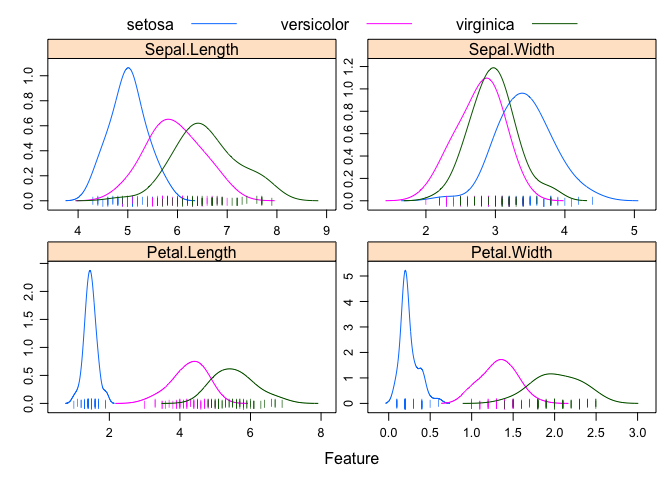
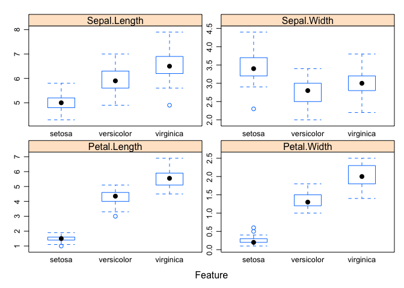
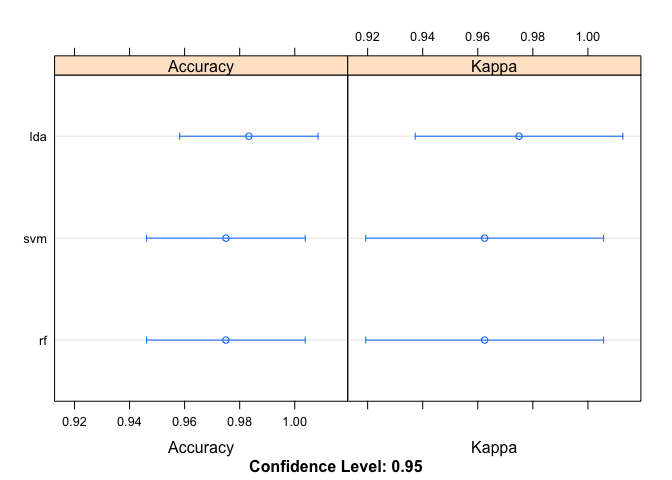

Introduction to Machine Learning
================

1. The data
-----------

In this example, we're going to use machine learning to classify genus *Iris* samples into different species. Species often overlap in any individual trait, so machine learning can let us use information from multiple traits at once to differentiate.


We first need to load the data and some libraries.

-   **iris** - A dataset of floral measurements for iris samples
-   **tidyverse** - A set of libraries for processing and plotting data *Highly recommended*
-   **caret** - A library for running machine learning

``` r
if (!require(tidyverse)) {
    install.packages("tidyverse")
    require(tidyverse)
}
if (!require(caret)) {
    install.packages("caret")
    require(caret)
}
if (!require(e1071)) {
    install.packages("e1071")
    library(e1071)
}

if (!require(randomForest)) {
    install.packages("randomForest")
    library(randomForest)
}
data("iris")
```

Lets take a look at the data:

``` r
head(iris)
```

    ##   Sepal.Length Sepal.Width Petal.Length Petal.Width Species
    ## 1          5.1         3.5          1.4         0.2  setosa
    ## 2          4.9         3.0          1.4         0.2  setosa
    ## 3          4.7         3.2          1.3         0.2  setosa
    ## 4          4.6         3.1          1.5         0.2  setosa
    ## 5          5.0         3.6          1.4         0.2  setosa
    ## 6          5.4         3.9          1.7         0.4  setosa

We have four columns with numeric traits, and one column with the known species identity. Before going to the trouble of machine learning, we should check if any of the traits cleanly separate the three species. We will be plotting the data using *ggplot2*.

``` r
    featurePlot(x = iris[, 1:4], 
                y = iris$Species,
                plot = "density", 
                scales = list(x = list(relation="free"), 
                              y = list(relation="free")), 
                adjust = 1.5, 
                pch = "|", 
                layout = c(2, 2), 
                auto.key = list(columns = 3)
                )
```



``` r
    featurePlot(x = iris[, 1:4], 
                y = iris$Species,
                plot = "box", 
                scales = list(x = list(relation="free"), 
                              y = list(relation="free")), 
                adjust = 1.5, 
                layout = c(2, 2))
```



We can see that although *setosa* has distinctly smaller petals, there is a lot of overlap between *versicolor* and *virginica*. Any single measurement is unlikely to be informative so we need **Machine Learning**!

### Study Questions:

1.  Which species has the widest sepals? The longest?
2.  If we didn't have any *versicolor* samples would you need machine learning to classify the two remaining species?
3.  Why is function for plotting the traits called "featurePlot"? What is a feature?

------------------------------------------------------------------------

2. The validation dataset
-------------------------

We are going to create a model to predict the species identity based on the floral features. To assess whether the model is accurate we need a set of samples with the same measurements, a known species identity that weren't used for model training.

``` r
# create a list of 80% of the rows in the original dataset we can use for training
training_index <- createDataPartition(iris$Species, p=0.80, list=FALSE)
# select 20% of the data for validation
iris_validation <- iris[-training_index,]
# use the remaining 80% of data to training and testing the models
iris_training <- iris[training_index,]
# check that sample sizes make sense
nrow(iris)
```

    ## [1] 150

``` r
nrow(iris_training)
```

    ## [1] 120

``` r
nrow(iris_validation)
```

    ## [1] 30

### Study Questions:

1.  Why can't we use the same samples in model training and model validation?
2.  Is it more important to have more training samples or validation samples?

------------------------------------------------------------------------

3. Training models
------------------

To train the models, we are going to use k-fold cross-validation. This splits the data into k parts, uses k-1 parts to train the model and the remaining part to test. We repeat this for each possible combination of parts and then repeat the whole process with different data partitions.


During this training, we also have to determine how to evaluate success. We are going to use *Accuracy*, which is simply the proportion of correct predictions in the test data. Another measure is *Kappa*, which accounts for the expected accuracy.

``` r
control_method <- trainControl(method = "cv", number = 10)
metric_method <- "Accuracy"
```

The next step is choose an model algorithm. There are many many possible models (238 in **caret** as of May 2018), each with different strengths and weaknesses. We're going to try three different models to compare their relative effectiveness.

``` r
# Linear Discriminant Analysis
set.seed(1000)
fit.lda <- train(Species~., data=iris_training, method="lda", metric=metric_method, trControl=control_method)
# Random Forest
set.seed(1000)
fit.rf <- train(Species~., data=iris_training, method="rf", metric=metric_method, trControl=control_method)
# Support Vector Machine
set.seed(1000)
fit.svm <- train(Species~., data=iris_training, method="svmLinear", metric=metric_method, trControl=control_method)
```

### Study Questions:

1.  What is another way of training a model, other than k-fold cross-validation? How does it work?
2.  What is kappa and how is it calculated?
3.  What is a scenario where accuracy is high but kappa is low? Why would this occur?

------------------------------------------------------------------------

4. Selecting a model
--------------------

Based on the cross-validation method, we have trained a model and measured its accuracy within the training dataset. We can visualize that here to choose the model that is most accurate.

``` r
# first we collate all the models together
model.results <- resamples(list(lda=fit.lda, rf=fit.rf, svm=fit.svm))
# print a summary of accuracy 
summary(model.results)
```

    ## 
    ## Call:
    ## summary.resamples(object = model.results)
    ## 
    ## Models: lda, rf, svm 
    ## Number of resamples: 10 
    ## 
    ## Accuracy 
    ##       Min. 1st Qu. Median   Mean 3rd Qu. Max. NA's
    ## lda 0.9167  1.0000      1 0.9833       1    1    0
    ## rf  0.9167  0.9375      1 0.9750       1    1    0
    ## svm 0.9167  0.9375      1 0.9750       1    1    0
    ## 
    ## Kappa 
    ##      Min. 1st Qu. Median   Mean 3rd Qu. Max. NA's
    ## lda 0.875  1.0000      1 0.9750       1    1    0
    ## rf  0.875  0.9062      1 0.9625       1    1    0
    ## svm 0.875  0.9062      1 0.9625       1    1    0

``` r
# plot accuracy
dotplot(model.results)
```



This suggests that the LDA model is working best and has an accuracy of 97.5%

``` r
# print best model
print(fit.lda)
```

    ## Linear Discriminant Analysis 
    ## 
    ## 120 samples
    ##   4 predictor
    ##   3 classes: 'setosa', 'versicolor', 'virginica' 
    ## 
    ## No pre-processing
    ## Resampling: Cross-Validated (10 fold) 
    ## Summary of sample sizes: 108, 108, 108, 108, 108, 108, ... 
    ## Resampling results:
    ## 
    ##   Accuracy   Kappa
    ##   0.9833333  0.975

### Study Questions:

1.  How consistent are accuracy measures? Do we get different values with different seeds? Why?
2.  Would you expect the same accuracy if you tested it on a whole other dataset? Why or why not?

------------------------------------------------------------------------

5. Validating the model
-----------------------

After creating our model, we now want to validate the accuracy of our model using independent data. Keep in mind, the accuracy we have seen is based on testing within the data that was used to create the model itself. Its possible for a model to be highly accurate in the training set and innacurate for the broader set of data. To do this, we leverage the validation subset that we stored at the beginning and didn't use for model training.

``` r
# predict species identity for the validation set
predictions <- predict(fit.lda, iris_validation)
# compare the predictions to true species identity
confusionMatrix(predictions, iris_validation$Species)
```

    ## Confusion Matrix and Statistics
    ## 
    ##             Reference
    ## Prediction   setosa versicolor virginica
    ##   setosa         10          0         0
    ##   versicolor      0          9         0
    ##   virginica       0          1        10
    ## 
    ## Overall Statistics
    ##                                           
    ##                Accuracy : 0.9667          
    ##                  95% CI : (0.8278, 0.9992)
    ##     No Information Rate : 0.3333          
    ##     P-Value [Acc > NIR] : 2.963e-13       
    ##                                           
    ##                   Kappa : 0.95            
    ##  Mcnemar's Test P-Value : NA              
    ## 
    ## Statistics by Class:
    ## 
    ##                      Class: setosa Class: versicolor Class: virginica
    ## Sensitivity                 1.0000            0.9000           1.0000
    ## Specificity                 1.0000            1.0000           0.9500
    ## Pos Pred Value              1.0000            1.0000           0.9091
    ## Neg Pred Value              1.0000            0.9524           1.0000
    ## Prevalence                  0.3333            0.3333           0.3333
    ## Detection Rate              0.3333            0.3000           0.3333
    ## Detection Prevalence        0.3333            0.3000           0.3667
    ## Balanced Accuracy           1.0000            0.9500           0.9750

Our model is 100% accurate for the validation set, which means that it works well and our estimate model accuracy is accurate.

### Study Questions:

1.  What is the validated accuracy of the other two models tested?
2.  If we reduced the sample size of our training set by 50% how will this affect the model accuracy? Try it out!
3.  What is overfitting? Do you think it is happening here?
